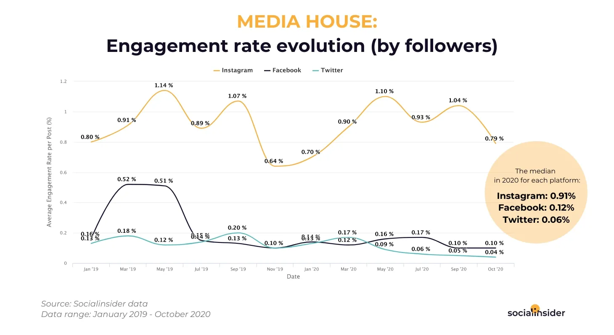
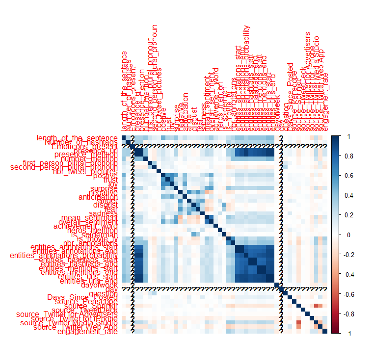

```{r setup, include=FALSE}
knitr::opts_chunk$set(echo = TRUE,warning = FALSE, message = FALSE)

#setup work directory

setwd('C:/Users/hgopalakrishnan/OneDrive - IESEG/Desktop/MBD-21/Social media analytics/group assignment/Group 11/Group 11')
load("./data/base_Table.RData")

```

## Abstract
  
Social media platforms have evolved over time with Twitter, Facebook and Instagram the most common of all. In fact, as of 2021, 4.48 billion people have been using social media, accounting for more than half the world population. Unsurprisingly, social media platforms have become a place where people connect with friends and family while updating themselves with what's going on in the wider world. Over the past few years, entrepreneurs have looked into the power of this social media platform in establishing a brand, marketing products and services, attracting new customers while maintaining strong relationships with existing clients. However, social media without engagement is just simply media and holds little meaning to people and businesses. In fact, Twitter has encountered a concerning issue as its platform’s engagement rate is only 0.09-0.33%, which is lower than other platforms. Therefore, in this report, we investigated different elements that affected the Marvel Entertainment account (@Marvel) on Twitter platform and hopefully shed light on some potential recommendations.  

## Introduction
  
Social media platforms have changed the ways businesses communicate with customers as they act as a public forum where customers can be engaged with the brand, products and services online. In businesses, strong social media engagement is an indication that a modern company with an online presence is having an impression on the market. It's not only about making the business well-known to a broader population; it's also about building real relationships with existing and potential consumers, which will help to increase the brand (and ROI) both on and off the internet.  

Social media has offered several advantages. It allows businesses to reach a large pool of potential customers and have a direct interaction with customers. By getting to know who’s interested, business owners can deliver more valuable content to customers and resolve any concerning issues that may arise promptly. Besides gaining insights on the customers' needs, social media can help businesses understand how customers perceive their products and services, and therefore capitalize on their strengths while mending their weaknesses. On the other hand, social media also has some downsides that may hurt businesses if not handled properly. Customers can share their poor experience online and spread it across the network, and the negative feedback may drive potential customers away. With social media, the content should be reviewed carefully in the given context as when a mistake is made, the impact may last a long time, even though the post is deleted later.  

Nowadays, there are many social media platforms in the market, including but not limited to Facebook, Twitter, LinkedIn, Instagram, Snapchat, TikTok, Pinterest, Reddit, YouTube, and WhatsApp. Among them, businesses tend to prefer Twitter, Facebook and Instagram. According to the Social Media Industry Benchmarking Report 2021, Facebook and Twitter engagement rates were stable, while engagement rates on Instagram were down. It is unfortunate that Instagram, a powerful channel, is on the decrease, but it is encouraging to see marketers interacting with their Twitter followers one-on-one. However, the engagement rate for Twitter remains lower than other channels. This occurred as Twitter users reportedly tend to unfollow a brand after 3 weeks if they were not impressed by the content or marketing strategy. The short half-life of a tweet (24 minutes) also contributed to the low engagement rate as half engagement rates were received in the first 30 minutes.  

As a result, we decided to assess and analyze the engagement of the Marvel Entertainment account (@Marvel) on Twitter platform in order to identify ways to improve the company's engagement. Before we discussed this particular case, some background information on industry social performance and engagement was provided.  

## Industry social performance and engagement overview
Average engagement rates per post for media business pages were equally low: 0.16 percent on Facebook, 0.86 percent on Instagram, and 0.08 percent on Twitter.  

What's intriguing with regards to this industry is that it has gone through massive changes over time from one month to another, with very high ups and exceptionally low downs.  

Another intriguing reality is that on Facebook, the normal commitment per industry post outperformed 0.50% during February - June 2019, at last dropping at Twitter's commitment levels.  


  
According to the survey, the media business is the most active on Twitter, with an average of 52.7 tweets each week.
   
## Methodology
  
Our methodology took into account different elements that affect social media engagement, in this case the Marvel Entertainment Twitter account (@Marvel). The data were extensively studied and processed using R, R Shiny, and R Markdown. Different preprocessing and cleaning methods were utilized and business models were created to elucidate elements that are crucial to Twitter social media engagement. Below is the list of some of the new variables that were created to build models to predict engagement rates.      
1. Sentiment (positive, negative, joy, surprise etc.)  
2. Sentiment Value (range -5 to 5)  
3. Day of the week (range 0 to 7)  
4. Day (Weekday or Weekend)  
5. Question (Presence of question - Boolean)  
6. Cashtag (Presence of Cashtag $ - Boolean)  
7. Days since posted (Recency)  
8. Achievement_words (Presence of words - Boolean)  
9. Heroes mention (Presence of top 100 superheroes - Boolean)  
10. Days Months mention (Presence of any day of the week or months, for ex. Monday, January etc. - Boolean)  
11. Length of the sentence  
12. Hashtags  
13. Hashtag present  
14. Number of hashtags   
15. Presence of emoji/emoticon   
16. What kind of emoji/emoticon - Emoji extract  
17. Presence of URL   
18. Tweets include a picture   
19. Presence of any @mentions in the tweet   
20. How many @mentions  
21. Presence of first person plural pronoun  
22. Presence of second person plural pronoun 
23. Source of the tweet
24. Presence of Spider Man related tweets
25. Is movie or TV series
26. Entities related features
  
## Company’s engagement overview
  
The pie chart represented the percentage of tweets in relation to the number of hashtags. The hashtag number ranged from 1 to 5. The majority of tweets (56.1%) contained 1 hashtag, followed by tweets with no hashtags (31.2%). 10.9% tweets had 2 hashtags and 1.48% tweets had 3 hashtags. Those with 4 or 5 hashtags had the lowest percentage of tweets with only 0.185%. In short, those with low hashtag numbers (0 or 1) had the highest percentage of tweets.  

```{r include = FALSE}

library(ggplot2)
library(dplyr)
library(plotly)
library(dplyr)

```


```{r, fig.dim = c(8, 3), echo=FALSE,fig.align='center'}

#options(repr.plot.width=4, repr.plot.height=4)

# Percentage of Tweets with Number of Hashtags

fig1 = base_table %>%
  group_by(Number_of_hashtags) %>%
  summarise(Count = n())

fig1_plot <- plot_ly(fig1, labels =~Number_of_hashtags, values = ~Count, type = 'pie',textinfo='label+percent')
fig1_plot %>% layout(title = '% Percentage of Tweets with Number of Hashtags',
                                  xaxis = list(showgrid = FALSE, zeroline = FALSE, showticklabels = FALSE),
                                  yaxis = list(showgrid = FALSE, zeroline = FALSE, showticklabels = FALSE))


#tmpFile <- tempfile(fileext = ".png")
#export(fig1_plot, file = tmpFile)
```
The bar chart depicted the engagement rate based on the number of hashtags. Overall, the average engagement rate of all hashtags was 0.007, which was roughly ten-fold lower than the engagement of Twitter in the general industry. The engagement rate was highest for tweets with 1 hashtag, followed by tweets with 3 hashtags. Tweets with 0 hashtags had an engagement rate of approximately 0.006, followed by tweets with 2 and 4 hashtags. Tweets with 5 hashtags had the lowest engagement rate. There is no direct correlation between the engagement rate and the number of hashtags, but it should be noted that tweets with 1 or 3 hashtags were most favorable in terms of engagement rates. In summary, Marvel Entertainment Twitter account (@Marvel) had a very low engagement rate, thus calling for changes, possibly through the encouragement of tweets with 1 or 3 hashtags.  

```{r, fig.dim = c(8, 3), echo=FALSE,fig.align='center'}

# Engagement Rate based on Number of Hashtags

fig_1.1 = base_table %>%
  group_by(Number_of_hashtags) %>%
  summarise(Average_Engagement_Score = mean(engagement_rate))  

fig_1.1 <- plot_ly(data=fig_1.1, x=~Number_of_hashtags,
                   y = ~Average_Engagement_Score) %>% 
  add_trace(type = "bar",
            x = ~Number_of_hashtags,
            y = ~Average_Engagement_Score,
            marker = list(color = c("silver",
                                    "red",
                                    "silver",
                                    "red",
                                    "silver",
                                    "silver"),
                          opacity = rep(0.7, 7))) %>% 
  layout(title = "Engagement Rate based on Number of Hashtags",
         xaxis = list(title = "Number of Hashtags",
                      zeroline = FALSE),
         yaxis = list(title = "Average Engagement Rate",
                      zeroline = FALSE))
fig_1.1
```
  
The chart described the percentage of tweets in relation to the presence of URL in tweets. Tweets without URL accounted for the majority of tweets (75.8%). This demonstrated that Marvel Entertainment Twitter account (@Marvel) did not embed URLs in their tweets often.  

```{r, fig.dim = c(8, 3), echo=FALSE,fig.align='center'}

# Percentage of Tweets with and without URL in Tweets

presence_url = base_table %>%
  group_by(presence_url) %>%
  summarise(count = n()) %>% 
  plot_ly(labels = ~presence_url, values = ~count,textinfo='label+percent') %>% 
  add_pie(hole = 0.6) %>% 
  layout(title = "% of Tweets with and without URL in Tweets",  showlegend = F,
         xaxis = list(showgrid = FALSE, zeroline = FALSE, showticklabels = FALSE),
         yaxis = list(showgrid = FALSE, zeroline = FALSE, showticklabels = FALSE))

presence_url

```
  
The bar chart demonstrated the influence of URL on the engagement rate.  Tweets with URL resulted in higher engagement rate (>0.008) as compared to those without URL (~0.007). This demonstrated that one strategy to improve the engagement rate was to encourage the act of embedding URL in the tweets.  

```{r, fig.dim = c(8, 3), echo=FALSE,fig.align='center'}

# Engagement Rate based on presence of URL in Tweets

presence_url_mean = base_table %>%
  group_by(presence_url) %>%
  summarise(Average_Engagement_Score = mean(engagement_rate))

p6 <- plot_ly(data=presence_url_mean, x=~presence_url,
              y = ~Average_Engagement_Score) %>% 
  add_trace(type = "bar",
            x = ~presence_url,
            y = ~Average_Engagement_Score,
            marker = list(color = c("silver",
                                    "red",
                                    "silver"),
                          opacity = rep(0.7, 7))) %>% 
  layout(title = "Engagement Rate based on presence of URL in Tweets",
         xaxis = list(title = "Presence of URL",
                      zeroline = FALSE),
         yaxis = list(title = "Average Engagement Rate",
                      zeroline = FALSE))
p6

```
  
The pie chart described the percentage of tweets in relation to the presence of emoticons. Tweets without emoticons accounted for 60.1 percent of Marvel's total tweets, whereas emoticons accounted for only 39.9%. This demonstrated that the corporation did not frequently employ emoticons in its tweets.  

```{r, fig.dim = c(8, 3), echo=FALSE,fig.align='center'}

# Percentage of Tweets with and without emoticons in Tweets

presence_emoticons_plt = base_table %>%
  group_by(Emoticons_present) %>%
  summarise(count = n()) %>% 
  plot_ly(labels = ~Emoticons_present, values = ~count,textinfo='label+percent') %>% 
  add_pie(hole = 0.6) %>% 
  layout(title = "% of Tweets with and without Emoticons in Tweets",  showlegend = F,
         xaxis = list(showgrid = FALSE, zeroline = FALSE, showticklabels = FALSE),
         yaxis = list(showgrid = FALSE, zeroline = FALSE, showticklabels = FALSE))

presence_emoticons_plt

```
  
The bar chart illustrated the effect of emoticons in tweets on the engagement rate. The average engagement rate of tweets with emoticons and tweets without emoticons was just slightly different. Both forms of involvement had a rate of roughly 0.007%. This demonstrated that the use of emoticons in tweets had no effect on their engagement rate.  

```{r, fig.dim = c(8, 3), echo=FALSE,fig.align='center'}

#Engagement Rate based on presence of URL in Tweets

presence_Emoticons_mean = base_table %>%
  group_by(Emoticons_present) %>%
  summarise(Average_Engagement_Score = mean(engagement_rate))

p6 <- plot_ly(data=presence_Emoticons_mean, x=~Emoticons_present,
              y = ~Average_Engagement_Score) %>% 
  add_trace(type = "bar",
            x = ~Emoticons_present,
            y = ~Average_Engagement_Score,
            marker = list(color = c("silver",
                                    "silver"),
                          opacity = rep(0.7, 7))) %>% 
  layout(title = "Engagement Rate based on presence of Emoticons in Tweets",
         xaxis = list(title = "Presence of Emoticons",
                      zeroline = FALSE),
         yaxis = list(title = "Average Engagement Rate",
                      zeroline = FALSE))
p6

```
  
The graph demonstrated the influence of the average engagement rate on the number of mentions. In tweets with one mention or no mention, the high engagement rate (> 0.007%) was observed. The highest average engagement rate, greater than 0.008%, was seen in tweets with no mention. However, there was no direct correlation between the number of mentions and the average engagement rate. 

```{r, fig.dim = c(8, 3), echo=FALSE,fig.align='center'}

# Engagement Rate based on the number of mentions in Tweets
presence_mentions_mean = base_table %>%
  group_by(number_mention) %>%
  summarise(Average_Engagement_Score = mean(engagement_rate))
p8 <- plot_ly(data=presence_mentions_mean, x=~number_mention,
              y = ~Average_Engagement_Score) %>% 
  add_trace(type = "bar",
            x = ~number_mention,
            y = ~Average_Engagement_Score,
            marker = list(color = c("silver","red","silver","silver","silver","silver","silver","silver","silver","silver","silver"),
                          opacity = rep(0.7, 7))) %>% 
  layout(title = "Engagement Rate based on the number of mentions in Tweets",
         xaxis = list(title = "Number of @ mentions",
                      zeroline = FALSE),
         yaxis = list(title = "Average Engagement Rate",
                      zeroline = FALSE))
p8

```
  
The graph depicted the average engagement rate based on days since tweeted. Overall, there was no direct correlation between the engagement rate and the number of days since tweeted. The highest engagement rate (>0.05) was observed at about 150 days since tweeted.  

```{r, fig.dim = c(8, 3), echo=FALSE,fig.align='center'}

# DAYS SINCE TWEETED vs ENGAGEMENT RATE
engagement_range = base_table %>%
  group_by(Days_Since_Posted) %>%
  summarise(Average_Engagement_Score = mean(engagement_rate))
p9 <- plot_ly(engagement_range, x = ~Days_Since_Posted, y = ~Average_Engagement_Score, name = 'trace 0', type = 'scatter', mode = 'lines') %>% 
  layout(title = "Average Engagement Rate based on Days Since tweeted",
         xaxis = list(title = "Days Since Tweeted",
                      zeroline = FALSE),
         yaxis = list(title = "Average Engagement Rate",
                      zeroline = FALSE))
p9

```
  
On the first three days of the week, Sunday, Monday, and Tuesday, the engagement score was more than 0.008%. The greatest engagement rate was more than 0.0095% on Monday tweets. In short, those three days may be associated with higher engagement rates.  

```{r, fig.dim = c(8, 3), echo=FALSE,fig.align='center'}

## TWEETS BASED ON THE DAYS OF THE WEEK -- STATS TAB
dayofweek_engagement = base_table %>%
  group_by(dayofweek) %>%
  summarise(Average_Engagement_Score = mean(engagement_rate))
dayofweek_engagement$dayofweek[dayofweek_engagement$dayofweek == 1] <- "1 - Sunday"
dayofweek_engagement$dayofweek[dayofweek_engagement$dayofweek == 2] <- "2 - Monday"
dayofweek_engagement$dayofweek[dayofweek_engagement$dayofweek == 3] <- "3 - Tuesday"
dayofweek_engagement$dayofweek[dayofweek_engagement$dayofweek == 4] <- "4 - Wednesday"
dayofweek_engagement$dayofweek[dayofweek_engagement$dayofweek == 5] <- "5 - Thursday"
dayofweek_engagement$dayofweek[dayofweek_engagement$dayofweek == 6] <- "6 - Friday"
dayofweek_engagement$dayofweek[dayofweek_engagement$dayofweek == 7] <- "7 - Saturday"
p11 <- plot_ly(data=dayofweek_engagement, x=~dayofweek,
               y = ~Average_Engagement_Score) %>% 
  add_trace(type = "bar",
            x = ~dayofweek,
            y = ~Average_Engagement_Score,
            marker = list(color = c("red","red","red","silver","silver","silver","silver"),
                          opacity = rep(0.7, 7))) %>% 
  layout(title = "Average Engagement Score based on days of the week",
         xaxis = list(title = "Days of the week",
                      zeroline = FALSE),
         yaxis = list(title = "Average Engagement",
                      zeroline = FALSE))
p11

```
  
## Model building and evaluation measure  

Understanding what makes some posts more interesting than others could be vital for gauging public opinion and gaining insights for a variety of purposes, including decision-making, advertising, etc. Predicting engagement could also help us develop specific content while keeping a few elements in mind that could influence consumers' perceptions of the organization.  

Based on 46 features, we used three machine learning models (linear regression, ridge regression, lasso regression) to forecast the engagement rate. The engagement rate was calculated using the below formula:

Engagement_rate = (1 * nbr_quote + 0.75 * nbr_retweet + 0.5 * nbr_reply + 0.25 * nbr_like) / (followers_count)) * 100

Where,

nbr_quotes = Number of quotes for the tweet
nbr_retweet = Number of retweets for the tweet
nbr_reply = Number of replies for the tweet
nbr_like = Number of like for the tweet
followers_count = Number of total followers of the account


### Correlation matrix  



The correlation between all possible pairings of values in a table was represented by the matrix. In this situation, it was clear that the correlation between variables is not significant. However, we also examined and identified the best predictor attributes that have a large impact on the model. Some of them are, 

* is_movie_tv (if a tweet is movie or series based)
* nbr annotations (number of topics related to the tweet: for example, movie + actor + brand, etc.)
* source_Twitter Web App
* dayofweek
* presence_mention : (presence of @)  
 
### Regression Models

We use regression models since we are going to predict the engagement rates for the tweets. We selected three regression models which are linear regression, Ridge regression and lasso regression. We run the model using ridge regression and lasso regression to check if it improves the model as some of the features might have multicollinearity issue. 

To run the model, the train and test data are created. We splitted the tweets database into two parts. One part with 70% of the data and the other one with 30%. The larger data is selected as the train data and the smaller as the test data. 

The main difference between ridge and lasso regression is that the alpha value of Ridge is taken as 0 whereas for lasso, the alpha value is 1.

The R-squared of the linear regression model was the one we're interested in since it calculates the dispersion of data points around the fitted regression line. Our model is having an R-Squared of 0.25, which implied that it accounted for 25% of the variance in engagement rate. 


### Evaluation

After the models are built, all three regression models were evaluated based on their performance using the train and test dataset. The results of the evaluation are as follows.

Linear Regression:
R-squared = 0.25,
Random Mean Square Error = 0.0031

Ridge Regression:
R-squared = 0.23,
Random Mean Square Error = 0.0032

Lasso Regression:
R-squared = 0.044,
Random Mean Square Error = 0.0036

The R-squared value for the lasso regression is higher which means that the features are performing comparatively better in lasso than in Ridege or Linear regression. The mean squared error is low for all the models i.e. below 0.0036 and hence it is good. 

The low R-squared value indicates that the social media posts trend irrespective of certain specific features and it needs to be closely looked upon. Adding further more features will increase the accuracy of the model. 


## Sentiment Analysis  

We normally look at a predetermined set of indicators to track when assessing how our material is performing on social media sites. However, this isn't the whole tale. To elicit a response, brands post material on social media channels. Every image, text, or video on a brand's page is intended to engage and elicit a response from the target audience.
Almost every piece of material has an emotional tone to it, but the key is whether or not that mood is properly conveyed to the user. Brands frequently upload content that backfires, resulting in a negative picture of the company. As a result, online sentiment analysis should be considered.  

### Types of Sentiment Analysis  

Sentiment analysis focuses on the polarity (positive, negative, or neutral) of a text, but it may also detect certain moods and emotions (angry, joyful, sad, etc.), urgency (urgent, not urgent), and even intentions (interested vs. not interested).  

Numerous Natural Language Processing techniques can be employed to approach sentiment analysis. One methodology to perform sentiment analysis uses a machine learning-based strategy to extract words from a corpus of documents and label (score) the sentiment terms. After the labeled data is known, these sentiment scores are used to anticipate the sentiment of new textual data. In this report, we focused on a different approach through the use of sentiment lexicons, which is a collection of words. In sentiment analysis lexicons, word lists with weights assigned to words based on polarity are utilized (positive, negative sentiments).  

#### Distribution of Sentiment scores present in tweets - AFINN Dictionary  

The AFINN lexicon is likely one of the most straightforward and often used lexicons for sentiment analysis. The AFINN dictionary contains 2477 coded words developed by Finn Arup Nielsen. The AFINN lexicon works by assigning negative values to terms that express negative sentiment and positive scores to words that express good sentiment.  

The chart clearly indicated that Tweets with neutral and positive sentiment scores got the highest frequency on the Marvel Twitter account. This indicated that the corporation intended to communicate a message with a spectrum of emotions ranging from neutral to positive.  

```{r, fig.dim = c(8, 3), echo=FALSE,fig.align='center'}

#Distribution of Sentiment scores present in tweets- AFINN DICTIONARY

base_table %>% plot_ly(x=~overall_sentiment) %>% 
  add_trace(type = "histogram",
            x = ~overall_sentiment,
            marker = list(color = c("black","black","black","black","black","black","black","red","black","black","red"),
                          opacity = rep(0.7, 7))) %>% 
  layout(title = "Distribution of Sentiment Score in Tweets- afinn",
         xaxis = list(title = "Sentiment Score",
                      zeroline = FALSE))

```
  
#### Average Engagement Rate based on Sentiment Score - AFINN Dictionary   

The bar chart demonstrated the average engagement rate in relation to different sentiment scores. The positive scores indicated positive sentiments while the negative scores implied negative sentiments. As presented, the highest average engagement rate was observed in the sentiment score of 11, followed by sentiment score of 19 - both were very positive scores. Unfortunately, there was no direct correlation between the sentiment scores and the average engagement rates. It may be worth noting that neutral or positive sentiment scores accounted for most tweets on the Marvel Twitter account.    

```{r, fig.dim = c(8, 3), echo=FALSE,fig.align='center'}

# Average Engagement Rate based on Sentiment Score - AFINN DICTIONARY

base_table %>% 
  group_by(overall_sentiment) %>% 
  summarise(avg_engagement = mean(engagement_rate)) %>% 
  plot_ly(x=~overall_sentiment,
          y = ~avg_engagement) %>% 
  add_trace(type = "bar",
            x = ~overall_sentiment,
            y = ~avg_engagement,
            marker = list(color = c("silver","silver","silver","silver","silver","silver","silver","silver","silver","silver","silver","silver","silver","silver","silver","silver","silver","silver","red","silver","silver","silver","silver","silver","red"),
                          opacity = rep(0.7, 7))) %>% 
  layout(title = "Average Engagement Rate based on Sentiment Score - afinn",
         xaxis = list(title = "Sentiment score",
                      zeroline = FALSE),
         yaxis = list(title = "Average Engagement Rate",
                      zeroline = FALSE))

```
    
#### Average Engagement Rate based on Sentiment Score - NRC Dictionary   

The NRC is a list of English words (5636 words) that predicts the sentiments and emotion in a given text. The NRC Emotion Lexicon was used to detect the presence of eight basic different emotions (anger, fear, anticipation, trust, surprise, sadness, joy, and disgust) and two sentiments (negative and positive). The NRC sentiment dictionary was built by Mohammad and Turney (2013) through crowd sourcing on Amazon Mechanical Turk. 

The pie chart illustrated different sentiments in the tweets. As shown below, positive sentiments accounted for the largest portion of all sentiments (30.4%), followed by surprise (15.8%), anticipation (11.5%) and trust (11.3%). Other sentiments accounted for less than 10% each with disgust having the lowest of all (2.78%). This demonstrated that the majority of the tweets conveyed positive, surprise, anticipation and trust sentiments.  

```{r, fig.dim = c(8, 3), echo=FALSE,fig.align='center'}

library(tidyr)
library(dplyr)
library(readr)

keep <- c("id","postive","trust","joy","surprise","negative","anticipation","anger","disgust","fear","sadness","engagement_rate")
sentiment_data = base_table[,colnames(base_table)  %in% keep]

sentiment_data_count = sentiment_data %>% 
  pivot_longer(!c(id,engagement_rate), names_to = "sentiments_", values_to = "count")
sentiment_data_count = as.data.frame(sentiment_data_count)

```


```{r, fig.dim = c(8, 3), echo=FALSE,fig.align='center'}

# Number of Sentiments present in Tweets - nrc dictionary

sentiment_data_count %>% 
  group_by(sentiments_) %>%
  summarise(sentiment_count = sum(count)) %>% 
  plot_ly(labels = ~sentiments_, values = ~sentiment_count,textinfo='label+percent') %>% 
  add_pie(hole = 0.6) %>% 
  layout(title = "% of Sentiments present in Tweets - nrc",  showlegend = F,
         xaxis = list(showgrid = FALSE, zeroline = FALSE, showticklabels = FALSE),
         yaxis = list(showgrid = FALSE, zeroline = FALSE, showticklabels = FALSE))

```
  
#### Average Engagement Rate per Sentiments - NRC Dictionary  

The bar chart depicted the average engagement rate in relation to different sentiments. Anticipation and fear had the highest average engagement rate. It was worth noting that those two sentiments did not account for the largest portion of the tweets (as represented by the above pie chart). In fact, anticipation accounted for 11.5% while fear only accounted for 5.62% of tweets. On the other hand, though many tweets contained positive sentiments (30.4%), it did not make a significant difference in the average engagement rate when compared to those showing negative sentiments (6.2%). As presented in the bar chart, the average engagement rate was relatively similar for the positive and negative sentiments (~0.006). As for anger, sadness, and disgust, those sentiments though were not present in a lot of tweets (less than 6% of tweets) had the average engagement rate not much different from positive sentiment which was present in 30.4% of tweets.  

```{r, fig.dim = c(8, 3), echo=FALSE,fig.align='center'}

# Average Engagement Rate per Sentiments

sentiment_data_count %>% 
  group_by(sentiments_) %>% 
  filter(!count == 0) %>% 
  summarise(sentiment_engage = mean(engagement_rate)) %>%
  plot_ly(x=~sentiments_,
          y = ~sentiment_engage) %>% 
  add_trace(type = "bar",
            x = ~sentiments_,
            y = ~sentiment_engage,
            marker = list(color = c("silver","red","silver","red","silver","silver","silver","silver","silver","silver"),
                          opacity = rep(0.7, 7))) %>% 
  layout(title = "Average Engagement Rate per Sentiments - nrc",
         xaxis = list(title = "Sentiments",
                      zeroline = FALSE),
         yaxis = list(title = "Average Engagement Rate",
                      zeroline = FALSE))

```
  
## Suggestions to increase company engagement rate  

Based on the above analysis, there are several ways that can be employed to boost the organic engagement rate of the Marvel Twitter account:  

* Embed a URL in tweets. As previously presented, tweets that contained a URL had a higher average engagement rate than those without.  

* Schedule tweets in advance on Sunday, Monday, and Tuesday. Businesses might think that tweeting daily is required to maintain their presence and retain viewers' engagement. However, this act might not give much in return as customers might not be available at all times. Instead, it is recommended to post at the best times when people are most likely engaged. In this report, we showed that Sunday, Monday, and Tuesday had the highest average engagement rates. By sharing the contents, the Marvel account can get most people viewing and clicking.  

* Limit hashtags to 1-3. Nowadays, businesses are tempted to increase the number of hashtags to make posts easier to find; however, customers care more about the content value. Excessive number of hashtags without real value does not increase the viewers' engagement; on the contrary, it makes the posts look spammy. Therefore, it is crucial to use hashtags wisely. In this report, we analyzed the Marvel Twitter account and arrived at the same conclusion that  higher hashtags did not associate with higher average engagement rate. In fact, tweets with 5 hashtags had the lowest engagement rate.  

* Marvel is a media corporation, and most of its Tweets are about movies or television programs. As our model predicts, Tweets regarding these themes will elicit more responses from Twitter users. As a result, the contents of Tweets should be focused on trending or new movies, and series TV. Furthermore, the posts should contain more than one theme; the mix of themes will result in a higher engagement rate as it reaches a wide variety of users and therefore boosting user interactions.  

* Twitter WebApp is a little webview application that was created using HTML, CSS3, and Javascript. It's not just a link like other social applications; it's a fully functional app. Surprisingly, Twitter WebApp source has a significant impact on the company's engagement rate over the other source. As a result, this application should be used to schedule and post Tweets.  

## Conclusion

It is an established fact that social media acts as a bridge between the businesses and the audience. Twitter is a great example of fully functional social media platforms that should be employed to increase the brand's customer engagement. However, Twitter should be used wisely so that the tweets can engage the audience more effectively. In this report, we analyzed the Marvel Entertainment account (@Marvel) on Twitter using R, R Shiny, and R Markdown. Through data analysis, we highlighted a few key elements, and therefore offered potential solutions that would help keep customers engaged including embedded URL, scheduled postings, limited hashtags, and the use of mixed themes in tweets.


